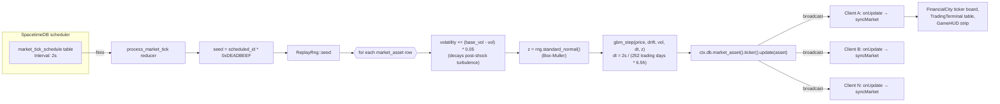
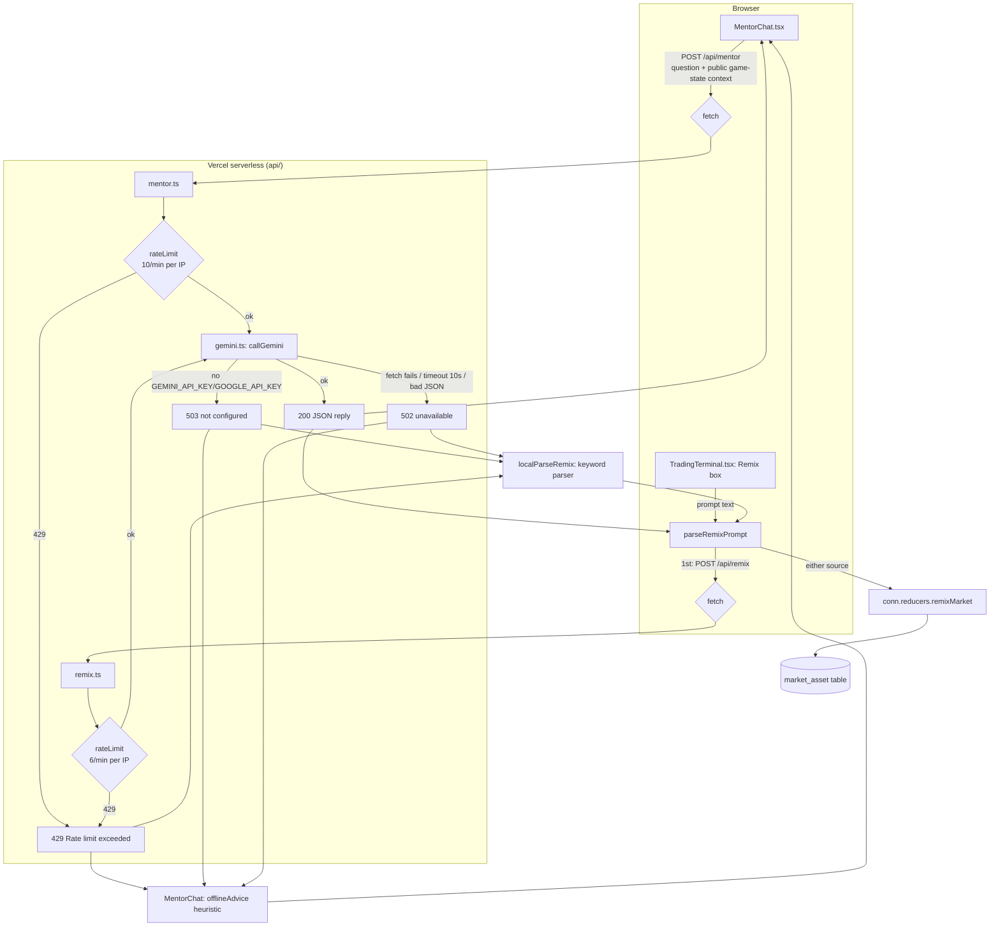

# QuantLink — Architecture Map

Deep-dive companion to the root `CLAUDE.md`/`README.md`. Where those give the
map's legend, this traces the actual data flow, reducer contracts, and config
surface as verified by reading the code (not just comments).

## 1. Folder map

```
quant-link/
├── server/                    SpacetimeDB Rust module (compiled to WASM)
│   ├── Cargo.toml              deps: spacetimedb = "2.4", log = "0.4" — that's it
│   └── src/
│       ├── lib.rs               table defs + reducers + lifecycle hooks (500 lines)
│       ├── common.rs             Vector3, InputState, PLAYER_SPEED/SPRINT_MULTIPLIER
│       ├── player_logic.rs       calculate_new_position, update_input_state
│       ├── market_logic.rs       GBM tick, buy/sell, vehicles, shocks, remix
│       ├── firm_logic.rs         firm tiers, employees, properties, cash-flow, rich list
│       ├── quest_logic.rs        10-quest catalog + server-side condition checks
│       └── sim_math.rs           pure GBM/RNG/firm math — zero spacetimedb deps, unit-tested
├── client/                    Vite + React 19 + React Three Fiber
│   └── src/
│       ├── App.tsx               connection, 20Hz input loop, subscriptions, top-level state (877 lines)
│       ├── main.tsx              real entry point (mounted from index.html)
│       ├── main.ts                DEAD — not referenced anywhere, prints one console.log (see AUDIT)
│       ├── demoTimeline.ts        scripted `?demo=1` 3-minute auto-play tour
│       ├── simulation.ts          `npm run simulate` — N headless bots for load testing
│       ├── components/           GameScene, FinancialCity, Player, TradingTerminal,
│       │                         MentorChat, NewsTicker, QuestLog, RichList, GameHUD,
│       │                         PlayerUI, JoinGameDialog, DebugPanel
│       ├── services/
│       │   └── AI_Market_Events.ts   offline "simulated" news generator + remix
│       │                             (proxy-first, local-keyword-parser fallback)
│       └── generated/            spacetime-generate TypeScript bindings — do not hand-edit
├── api/                       Vercel Node serverless functions (zero npm deps)
│   ├── mentor.ts                POST /api/mentor — context-aware quant mentor
│   ├── remix.ts                 POST /api/remix — NL prompt → market params
│   └── _lib/
│       ├── gemini.ts             REST call to Gemini, 10s timeout, thinking disabled
│       ├── ratelimit.ts          in-memory per-instance sliding window
│       └── types.ts              minimal ApiRequest/ApiResponse (no @vercel/node dep)
├── unreal/SimWorld/           UNUSED early Unreal prototype — not wired, not built, ignore
├── docs/                      PROJECT-NOTES.md (deploy/verification log), this file, CODE-AUDIT.md
├── scripts/publish-maincloud.sh   spacetime build + publish to maincloud
├── .github/workflows/ci.yml   cargo test + wasm build; client tsc + vite build
└── vercel.json                 builds client/ → client/dist, serves api/ as functions
```

## 2. Client input → reducer → table → subscription loop (20Hz)

Every connected browser runs this loop continuously while `connected === true`:

```mermaid
sequenceDiagram
    participant KB as Keyboard/Mouse (App.tsx listeners)
    participant Loop as requestAnimationFrame loop
    participant Ref as currentInputRef (mutable, no re-render)
    participant Conn as SpacetimeDB conn.reducers
    participant Srv as update_player_input reducer
    participant Tbl as `player` table row
    participant Sub as onUpdate subscription callback
    participant UI as React state (players Map / localPlayer)
    participant R3F as Player.tsx useFrame (client prediction)

    KB->>Ref: keydown/keyup/mousemove mutate currentInputRef directly
    loop every RAF frame
        Loop->>Loop: if now - lastSendTime >= 50ms (~20Hz)
        Loop->>Ref: sequence += 1
        Loop->>Conn: updatePlayerInput({input, clientPos, clientRot, clientAnimation})
    end
    Conn->>Srv: WS message → update_player_input(ctx, input, _client_pos, client_rot, client_animation)
    Note over Srv: _client_pos is IGNORED — server recomputes position itself
    Srv->>Srv: player_logic::update_input_state()<br/>calculate_new_position() using fixed dt=1/20
    Srv->>Tbl: ctx.db.player().identity().update(player)
    Tbl-->>Sub: SpacetimeDB broadcasts row update to ALL subscribed clients
    Sub->>UI: setPlayers(...), setLocalPlayer(...) if it's me
    UI->>R3F: playerData prop changes
    R3F->>R3F: predict position locally each real frame (dt),<br/>reconcile via lerp when drift > 0.4 units
```

Key points:
- The **send** side is throttled to 20Hz (`INPUT_SEND_INTERVAL = 50ms`) in `App.tsx`,
  driven by `requestAnimationFrame`, not `setInterval` — so it also implicitly
  throttles to display refresh rate.
- Input state itself lives in a `useRef` (`currentInputRef`), not React state,
  so keydown/mouseup never trigger a re-render — only the periodic send does.
- The server treats the client's reported position (`_client_pos`) as **advisory
  and unused** (parameter is prefixed `_` and never read) — it authoritatively
  recomputes `calculate_new_position` from the *previous* row position + the
  input state using a fixed assumed `delta_time_estimate = 1/20`, not a
  server-measured elapsed time. This means server movement speed is correct
  only if the client actually sends at ~20Hz; a stalled/throttled client
  reduces its own effective movement speed rather than teleporting.
- **Rendering fan-out**: every table mutation is pushed to every subscribed
  client via SpacetimeDB's built-in pub/sub — there's no polling.
- **Client-side prediction** (`Player.tsx`) recomputes the *same* movement
  formula locally every rendered frame using the real frame `dt` for smooth
  60fps motion between 20Hz server updates, then reconciles toward the
  authoritative server position via `lerp`/`slerp` once positional error
  exceeds `POSITION_RECONCILE_THRESHOLD = 0.4` world units (rotation threshold
  is defined but not read anywhere — see CODE-AUDIT).

## 3. Market GBM tick fan-out (every 2 seconds, scheduled reducer)



Every client independently maintains `marketAssets` React state populated from
`conn.db.market_asset.iter()` on `onInsert`/`onUpdate`/`onDelete` — there is no
per-client math; all clients see byte-identical prices because the GBM math
runs once, server-side, and the deterministic-seed RNG makes a given tick
replayable even though it's driven by a live schedule (see
`sim_math.rs::ReplayRng`, seeded from `scheduled_id`).

`apply_market_shock` (AI ambient news) and `remix_market` (player prompt-driven)
are the two other paths that mutate `market_asset` outside the regular tick —
both are ordinary reducers invoked by any connected client, broadcasting the
same way.

## 4. Mentor / Remix AI proxy, with offline fallback



Notes:
- **The Gemini API key never reaches the browser.** It is read server-side
  only in `api/_lib/gemini.ts` (`GEMINI_API_KEY` falling back to
  `GOOGLE_API_KEY`); `client/.env.example` explicitly warns never to add a
  `VITE_`-prefixed LLM key because Vite inlines those into the public bundle.
  `docs/PROJECT-NOTES.md` records a real grep of the built bundle confirming
  no key/`googleapis` reference leaked.
- **Ambient market news is intentionally never LLM-backed** — every connected
  client independently runs a local `setInterval` firing `apply_market_shock`
  every 60s using `AI_Market_Events.ts::simulatedEvent()` (template-based,
  labeled `source: 'simulated'`). This avoids N clients × 1/min hammering the
  Gemini quota for a feature that doesn't need real generation. Only the
  player-initiated "Remix" prompt actually calls Gemini.
- `callGemini` sets `AbortSignal.timeout(10_000)` and `thinkingConfig: { thinkingBudget: 0 }`
  specifically because 2.5-class Flash "thinking" was observed truncating
  short answers (documented decision from a real debugging session, see
  `docs/PROJECT-NOTES.md`).
- Rate limiting is **per-warm-lambda-instance**, not global/distributed — a
  documented, deliberate scope limitation (no Redis dependency for a
  single-key quota guard).

## 5. Reducer catalog

All reducers live in `server/src/lib.rs` (thin wrappers) delegating to
`market_logic.rs` / `firm_logic.rs` / `quest_logic.rs` / `player_logic.rs`.

| Reducer | Server-side validation | Notes |
|---|---|---|
| `register_player(username, character_class)` | No-op if identity already has a `player` row. Rejoins from `logged_out_player` preserve cash/knowledge/health but reset spawn position. | Assigns spawn color/position by `player_count % 6` — not identity-derived, so color can collide after churn. |
| `update_player_input(input, _client_pos, client_rot, client_animation)` | None on the input booleans themselves (no anti-cheat on speed/teleport beyond fixed-dt recompute). `_client_pos` is accepted but **ignored**. | Silently no-ops if `ctx.sender()` has no player row (e.g. race before `register_player` completes). |
| `game_tick` (scheduled, 1s) | N/A (system-triggered) | Calls `process_firm_tick` + `update_rich_list` only; player movement is NOT part of this tick (moved to `update_player_input`, per code comment). |
| `process_market_tick` (scheduled, 2s) | N/A (system-triggered) | Seeds `ReplayRng` from `scheduled_id.wrapping_mul(0xDEAD_BEEF)`; mean-reverts volatility 5%/tick toward baseline. |
| `execute_trade(ticker, shares, is_buy)` | `shares > 0`; player row exists; asset exists; buy requires `cash_balance >= cost`; sell requires an existing position with `shares >= requested`. | Weighted-average cost basis on buy; deletes position if remaining shares `< 0.0001` (float dust). No max-position-size or wash-trade limits. |
| `buy_vehicle(vehicle_key)` | Player + catalog entry exist; `cash_balance >= price`. | No per-player vehicle limit. |
| `upgrade_knowledge_level()` | Player exists; `knowledge_level < 3`. | Purely cosmetic gate (no cash cost visible in this reducer). |
| `hire_employee(role)` | Player + firm exist; headcount `< 8 + tier*4`; `role` in {trader, researcher, compliance, engineer} else `Err`; `cash_balance >= salary*10` signing bonus. | Adjusts firm reputation/regulatory_risk by fixed per-role deltas, clamped [0,100]. |
| `buy_property(property_key)` | Player + firm + catalog entry exist; `cash_balance >= price` (if `price > 0`); `firm.tier >= firm_tier_required`; rejects if already owned (linear scan of owned rows). | |
| `upgrade_firm()` | Player + firm exist; `next_tier < TIERS.len()`; net worth `>= TIERS[next].0`; `cash_balance >= TIERS[next].1`. | `TIERS` constant duplicated conceptually in `TradingTerminal.tsx` (`TIER_NAMES/TIER_REQS/TIER_COSTS`) — client copy is display-only but must be kept in sync by hand. |
| `claim_quest_reward(quest_key)` | `quest_key` must be in the 10-entry `QUESTS` catalog; not already claimed (linear scan of `completed_quest` by owner); `quest_condition_met()` re-derives the condition live from server tables (portfolio count, net worth, employee count, etc.) — **never trusts client-reported progress**. | Quest thresholds are duplicated a second time in `QuestLog.tsx` for progress-bar UI — display-only, but a third place to keep in sync. |
| `apply_market_shock(headline, sentiment)` | `sentiment` clamped to [-10,10] (both in this reducer and again in `push_news`). | **Not authenticated/gated to any role** — any connected client can call this reducer directly (bypassing the AI generator entirely) and violently move the market for everyone. See CODE-AUDIT. |
| `remix_market(ticker, drift_modifier, volatility_modifier, headline)` | `drift_modifier` clamped [-0.5, 0.5]; `volatility_modifier` clamped [-0.5, 0.8]; price jolt further clamped to ±25%; resulting `asset.drift` clamped [-0.6, 0.8] and `asset.volatility` clamped [0.05, 0.95] after applying. `ticker` uppercased; unmatched ticker → silently a no-op affecting zero rows (not an error). | Same as `apply_market_shock`: callable directly by any client with arbitrary values within the clamps — clamps bound the *damage per call*, not *call frequency* (no per-player rate limit server-side; only the optional `/api/remix` proxy has one, and the reducer can be called without ever going through that proxy). |

## 6. Config surface

| Setting | Where read | Default | Notes |
|---|---|---|---|
| `VITE_SPACETIME_HOST` | `client/src/App.tsx`, `client/.env.example` | `maincloud.spacetimedb.com` (App.tsx) / `127.0.0.1:3001` (`.env.example`, local) | ws/wss prefix auto-derived from host string. |
| `VITE_SPACETIME_DB` | same | `quant-link` | Module name, consistent everywhere. |
| `SPACETIME_HOST` / `SPACETIME_DB` | `client/src/simulation.ts` (load-test bots, run via `tsx` not Vite) | falls back to `VITE_` vars, then `127.0.0.1:3001` / `quant-link` | Kept coherent with the client on purpose (was previously hardcoded to stale values — see `docs/PROJECT-NOTES.md`). |
| `GEMINI_API_KEY` / `GOOGLE_API_KEY` | `api/_lib/gemini.ts` | none — throws `GeminiNotConfiguredError` → 503 | Server-side Vercel env only. Root `.env.example`. |
| `GEMINI_MODEL` | `api/_lib/gemini.ts` | `gemini-flash-latest` | Overridable to pin a specific model version. |
| Vercel build | `vercel.json` | `cd client && npm ci` / `npm run build` / `client/dist` | `api/` functions ship automatically from the `api/` folder convention, zero extra config. |
| Rust module deps | `server/Cargo.toml` | `spacetimedb = "2.4"`, `log = "0.4"` | Intentionally minimal; no other crates. |
| CI | `.github/workflows/ci.yml` | triggers on push to `main`/`prod-hardening` + all PRs | Two jobs: `cargo test --lib` + `cargo build --release --target wasm32-unknown-unknown`; client `npm ci` + `npm run build` (which runs `tsc -b` first). No lint step, no client tests in CI (there are no client test files at all). |

## 7. Test layout

- **Server**: `server/src/sim_math.rs` has the *only* test module in the
  repo — 13 `#[cfg(test)]` unit tests covering `ReplayRng` (determinism,
  divergence, uniform range, standard-normal moments) and `gbm_step`
  (flatness at zero params, exact drift at `z=0`, Itô variance-drag sign,
  long-run positivity over 500k steps, log-return distributional moments)
  plus `firm_net_flow` (idle=0, income>payroll positive, payroll-heavy
  negative, monotonic in salary). All run natively (`cargo test --lib`,
  no wasm32 needed) because `sim_math.rs` is deliberately free of
  `spacetimedb` types, so the exact production math is exercised, not a copy.
  Verified passing: `13 passed; 0 failed` in ~0.03s.
- **`market_logic.rs`, `firm_logic.rs`, `quest_logic.rs`, `player_logic.rs`,
  `lib.rs` reducers**: **zero tests.** All input validation described in §5
  is exercised only by manual/integration play, not automated tests.
- **Client**: **zero test files** anywhere under `client/src` (no `*.test.*`
  / `*.spec.*`, no test runner configured in `package.json`). CI only
  type-checks (`tsc -b`) and production-builds the client; it does not run
  or even define any client tests.
- **Load/soak testing**: `client/src/simulation.ts` (`npm run simulate`)
  spawns N headless SpacetimeDB clients that register and wander for a
  configurable duration — a manual load-test tool, not part of CI.
